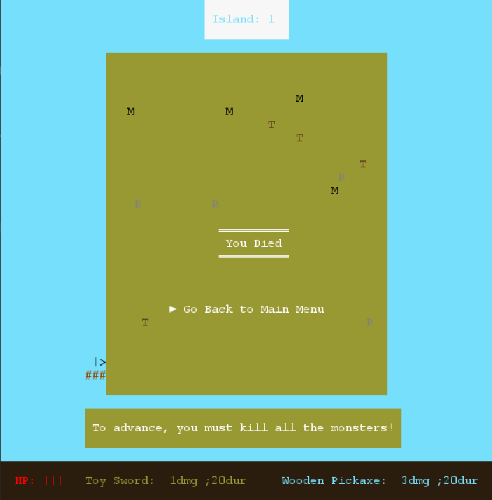
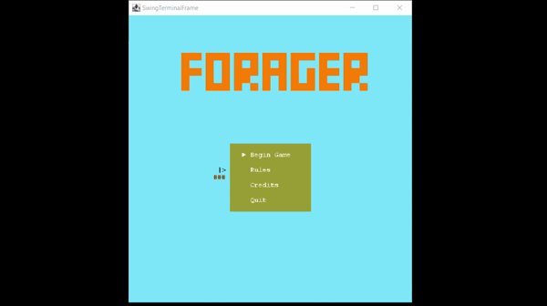

# **LPOO_T7G2 - Forager**

Forager is 2D open world game where the player will  be able to simulate a variety of tasks related to farming, hunting, manufactering, mining and more.

The player progresses in the game by obtaining resources that spawn randomly throughout each island.
With these resources the player is able to build new objects or tools which will be of great help when solving quests. After sucessfully solving the quests provided, the player will be able to enter a new, harder island.

This project was developed by Edgar Torre (up201906573@fe.up.pt), João Afonso (up201905589@fe.up.pt) and Sérgio Estêvão (up201905680@fe.up.pt).

# **Some screenshots**

Base Island |   Vendor Menu
:-------------------------:|:-------------------------: 
 | 

Buy menu  |   Sell menu
:-------------------------:|:-------------------------: 
 | 

Pause  |   Travelling
:-------------------------:|:-------------------------:
 | 

 Island  |   Dead
:-------------------------:|:-------------------------: 
 | 

# **Gameplay**

