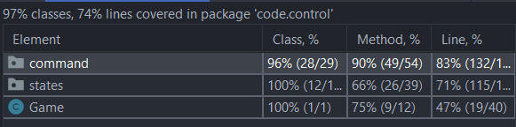

# **LPOO_T7G2 - Forager**

Forager is 2D open world game where the player will  be able to simulate a variety of tasks related to farming, hunting, manufactering, mining and more.

The player progresses in the game by obtaining resources that spawn randomly throughout each island.
With these resources the player is able to build new objects or tools which will be of great help when solving quests. After sucessfully solving the quests provided, the player will be able to enter a new, harder island.

This project was developed by Edgar Torre (up201906573@fe.up.pt), João Afonso (up201905589@fe.up.pt) and Sérgio Estêvão (up201905680@fe.up.pt).

## **Implemented Features**

### **Menu Navigation**

- The player is able to enter, navigate and exit all the menus in the game by pressing the keys 'W' and 'S', to move to the previous and next option, correspondly and pressing the key 'ENTER' to select the option highlighted by the pointing arrow.

### **Rules and Credits**

Rules   |   Credits
:-------------------------:|:-------------------------:
 | 

### **Move**
- The player is able to move in 4 possible directions which include: up, down, left and right with the keys 'W', 'A', 'S', 'D', respectively.

### **Attack/Collect**
- The player is able to attack monsters and collect resources he finds throughout the game using the key 'E' when turned to them.

### **Items**
- The items are divided into attack tools, resource collecting tools or potions.
- Each of the attack and resource collecting items have durability, which if it reaches 0 breaks the item being it replaced by the player's fists. Despite the fact that you can use all items on either monsters or resources (decreasing its durability), the collecting resources items won't deal any damage to monsters and in the same way, neither will attack items deal any damage to resources
- The potions can be bought with resources obtained from killing the monsters ("flesh") and when used allow the player to restore 1 health
### **Base map**
- The player will spawn on an island which corresponds to his checkpoint. Whenever the player dies or starts the game he will be sent there. He can also go there when he travels, as there's an option in the travelling menu which allows him to go back home when on another island.
- Here you can see the vendor, the player and a boat which allows you to travel.

### **Player's stats**
- The player can always check what his stats are at the bottom of the screen. Here he is able to check his HP ("HP: | | | ") and which tools he has equipped at the moment (being the left tool the atack tool and the right tool the resource collecting tool)
- He is also able to change between both tools pressing the 'TAB' key (being the selected tool the one colored with blue) 

*Player's stats*

### **Inventory**
- The player can open his inventory by pressing the key "I"
- Here the player is able to check what he currently has on his inventory. In the begining of the inventory he can check his tools and then separated by a space his resources
- The player can also switch the items which he is currently using by going to that item and pressing the key 'ENTER'. The item will then be switched to the player's stats bar according to it's type

*Player's inventory*

### **Vendor's menu**
- When the player interacts with the vendor a menu will appear, which will allow him to choose between selling any of his current items or buying new ones.

*Shop's main menu*

- In the buy menu, the player can check his inventory of resources and which items the vendor is selling, along with the corresponding recipe. When the player chooses a item, it is shown the recipe of that corresponding item. Then if desired, the player can buy the item, as long as he has enough resources available

- In the sell menu, the player can check his inventory of items and resources. When the player chooses the item which he pretends to sell, the potential resources received are shown and then, in case the player actually sells the item, those resources are added to his inventory

  Buy   |   Sell 
:-------------------------:|:-------------------------: 
 | 

### **Travelling and Pause Menu**

- At any point of the game the player can press the key 'ESC', appearing the pause menu. Here the player has the option to go back to the main menu (resetting all progress) or resume the game.
- When he interacts with the boat the player has the option to just go back home, to travel to the next island or to just resume the game at the current island.
  

Pause  |   Travelling
:-------------------------:|:-------------------------:
 | 

### **Island**

- When the player chooses the "Next Island" option he will be sent to another island where there'l be monsters that want to kill the player, resources to be collected and another boat in case the player decides to go back home, or to travel to the next island (althought he can only choose this option once he kills all the monsters on the current island)
- The number of monsters increases every time you move to a new Island, and they always try to move closer and closer to the player.

*Island*

### **Dying**
- If the monsters hit the player three times in a row, without him using a potion in between, then the player will die, loose all progress and a menu will appear with the option of going back to the main menu

*Dead Menu*

## **Gameplay**

## Planned Features

- Random islands with different layouts 
- Variety of monsters, resources and items
- Highscore system 
- Use new fonts, designed by us to represent each of the game's components

# Architectural Structure

## MVC

### **Problem in context**

All of the classes used on our program were all clumped up in one single directory. Therefore we needed to organize the code in order to make our job easier.

### **The pattern**

The MVC is a pattern used to separate the program's entire code into three different components: Model, View and Control.

### **Implementation**

We divided the main file of the program into three different directories, one for each of the different components of the MVC structure.

### **Consequences**

The code became much more organized and it also became easier to make any change to the program.

##Game Components

### **Problem in context**

Our game is composed by lots of different movable and immovable objects. Both of these types of objects need to be placed and drawn on the island. For this they need to have a Position (which allows them to be drawn on the screen). 

If we simply just created each one of these components with a Position, large amounts of data would be passed around classes together creating a possible Data Clump

### **The Pattern**

To solve this problem we created two different classes, Destructible (that compiles all the immovable objects) and Character (which compiles the Hero and Monsters) which inherit the Element class. 

### **Implementation**

### **Consequences**
- We were able to avoid Data Clumps
- The code became more organized and simpler, also avoiding repeated code
#Design Patterns

##State Pattern

### **Problem in context**
In our game there are a lot of different states which will be continually alternated during the game's execution such as: Game, Inventory, Pause, Shop among many others...

If we didn't implement this pattern we would be violating the Single Responsability Principle and the Open Closed Principle.

### **The pattern**
We implemented the State pattern. This way we managed to create two main states: GameState and MenuState which both implement the State interface.

We then created subclasses for each of the states on our game which implement a function that returns a command and a function that draws. This way we divided the game into diferent states that behave diferently.

### **Implementation**
Example of a few of our states:

### **Consequences**
- Using this pattern allowed us to organize the different states of the game
- It also made it easier to insert a new state when needed

## Command

### **Problem in context**
All of our player's movements and actions are done by user input. In order to do this we needed to find a way to get the user's input and transform it in order to change the game and update the objects in it accordingly.

### **The Pattern**
To do this we implemented the Command Pattern, which allows us to convert user input into different actions in the game (commands that depend on the current state of the game) such as moving, attacking, interacting etc...

### **Implementation**

### **Consequences**
- Easier management of new inputs and actions

## Item factory

### **Problem in context**

The Player will be capable of carrying different types of tools, which can be bought at the Vendor. If we decided to create a large number of differente items, then
the Vendor class would  get  way bigger and more confusing as a result.

### **The pattern**

The factory design pattern consists in an interface for creating objects in a superclass, but allows other subclasses to alter the objects that will be created by the superclass.

### **Implementation**

### **Consequences**

Using this pattern the code becomes easier to understand and simplifies the addition of new types of Tools in the future.

# **Code Smells and Refactoring**

## **Bloaters**

### **Long Class**
* Our hero class contained many fields, methods and lines of code
* We tried to counter act this by creating a sub class Inventory, but we still think the class is too big

### **Long Method**
* Almost all viewers have 1 or 2 long drawing methods
* We tried to correct this smell but since we wanted to draw the game with details this was not possible
## **Dispensable**

### **Duplicate code**

* In our viewer classes some code is being repeated in the draw method of each corresponding class

## **Object-Oriented Abusers**

### **Switch Statements**

* Theres two large sequences of if statements being used when it comes to detecting the player's input 
* We haven't found a way to counter this code smell, so it remains the same
## **Couplers**
### **Message Chains**
- We have some series of calls where a object requests another object, that requests another object and so on which means that the first object is dependant  on navigation along the class structure
# **Testing**

## **Tests Coverage**

## **Tests Coverage on control**

### **Tests Coverage on control command**

#### **Tests Coverage on control command menu**

#### **Tests Coverage on control command player**

#### **Tests Coverage on control command states**

### **Tests Coverage on control states**

## **Tests Coverage on model**

### **Tests Coverage on model elements**

### **Tests Coverage on model items**

### **Tests Coverage on model maps**

## **Tests Coverage on view**

### **Tests Coverage on view elements**

### **Tests Coverage on view game**

### **Tests Coverage on view gui**

# **Evaluation**
All the group members participated in equal ways.

Names          | Percentage
-------------  | -------------
Edgar Torre    |     33,3..%
João Afonso    |     33,3..%
Sérgio Estêvão |     33,3..%
